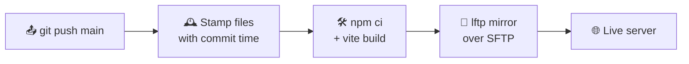

<div align="center">


# ✨ Delwar Hossain — Developer Portfolio

**A fast, accessible, admin-managed portfolio built with Laravel 13.**
<br>
Showcase experience and projects, collect messages, and manage everything from a clean dashboard.

<br>

[](https://laravel.com)
[](https://php.net)
[](https://mysql.com)
[](https://tailwindcss.com)
[](https://vitejs.dev)

[](https://github.com/delwarhossaindev/portfolio/actions/workflows/deploy.yml)
[](https://opensource.org/licenses/MIT)
[](https://github.com/delwarhossaindev/portfolio/commits/main)

[🚀 Quick Start](#-quick-start) •
[🌟 Features](#-features) •
[🛠 Tech Stack](#-tech-stack) •
[☁️ Deployment](#%EF%B8%8F-deployment) •
[🗺 Routes](#-routes)

</div>

---

## 🌟 Features

<table>
<tr>
<td width="50%" valign="top">

### 🎨 Public Site
- 🏠 **Dynamic homepage** — hero, about, experience and projects, all from the database
- 📁 **Project detail pages** — gallery, key features, SEO-friendly slugs
- 💌 **Contact form** — rate-limited, with email notification
- 🌗 **Light / dark theme** with keyboard support
- 📱 **Fully responsive**, mobile-first layout

</td>
<td width="50%" valign="top">

### 🛡 Admin Panel
- 📊 **Dashboard** with stats at a glance
- ✏️ **Content editor** — profile & OG images auto-optimized
- 💼 **CRUD** for experiences, projects and articles
- 📬 **Inbox** — read / unread contact messages
- 👥 **Users, roles & permissions** via Spatie

</td>
</tr>
<tr>
<td width="50%" valign="top">

### 🔍 SEO & Performance
- 🧭 Auto-generated `sitemap.xml`
- 🏷 Open Graph, Twitter cards & JSON-LD schema
- ⚡ Query caching & database indexes
- 🖼 WebP images and lazy loading

</td>
<td width="50%" valign="top">

### 🔐 Security & a11y
- 🧱 Security headers middleware (CSP, HSTS …)
- 🚦 Throttled login & contact endpoints
- ♿ Skip links, landmarks, visible focus states
- 🧪 Dev-only tools locked out of production

</td>
</tr>
</table>

---

## 🛠 Tech Stack

| Layer | Technology |
| :--- | :--- |
| 🧠 **Backend** | Laravel 13 · PHP 8.3 |
| 🗄 **Database** | MySQL 8 (InnoDB, utf8mb4) |
| 🎨 **Frontend** | Blade · Tailwind CSS 4 · Vite 8 |
| 🛡 **Admin UI** | AdminLTE 3 · Font Awesome 6 |
| 🔑 **Access control** | spatie/laravel-permission |
| 📝 **Markdown** | league/commonmark |
| 🚀 **CI/CD** | GitHub Actions → SFTP (lftp) |

---

## 🚀 Quick Start

> **Prerequisites:** PHP 8.3+, Composer, MySQL 8, Node.js 22+

```bash
# 1️⃣  Clone
git clone git@github.com:delwarhossaindev/portfolio.git
cd portfolio

# 2️⃣  Install dependencies
composer install
npm install

# 3️⃣  Environment
cp .env.example .env
php artisan key:generate
```

**4️⃣ Create the database** and set the credentials in `.env`:

```sql
CREATE DATABASE portfolio CHARACTER SET utf8mb4 COLLATE utf8mb4_unicode_ci;
```

```env
DB_CONNECTION=mysql
DB_HOST=127.0.0.1
DB_PORT=3306
DB_DATABASE=portfolio
DB_USERNAME=root
DB_PASSWORD=
```

```bash
# 5️⃣  Migrate & seed
php artisan migrate --seed

# 6️⃣  Storage link & assets
php artisan storage:link
npm run build        # or: npm run dev

# 7️⃣  Run 🎉
php artisan serve
```

Open **http://localhost:8000** for the site and **/admin/login** for the dashboard.

> [!TIP]
> The seeder creates the first admin from `ADMIN_EMAIL` / `ADMIN_PASSWORD` in `.env`.
> Leave the password empty and a random one is generated and printed once.

### 🔄 Coming from SQLite?

An importer copies every row from an old SQLite file into MySQL:

```bash
php artisan migrate --force
php artisan db:import-sqlite database/database.sqlite --force
```

---

## ☁️ Deployment

Every push to **`main`** triggers [`.github/workflows/deploy.yml`](.github/workflows/deploy.yml):



Only files changed since the last deploy are uploaded. `vendor/`, `.env`, `storage/` and the database stay untouched on the server.

**🔑 Required repository secrets** (*Settings → Secrets and variables → Actions*):

| Secret | Example |
| :--- | :--- |
| `SFTP_SERVER` | `example.com` |
| `SFTP_USERNAME` | your cPanel login |
| `SFTP_PASSWORD` | your cPanel password |
| `SFTP_PATH` | `/home/<user>/public_html` |

**📋 After a deploy**, run on the server when needed:

```bash
php artisan migrate --force      # new migrations
composer install --no-dev        # composer.lock changed
php artisan optimize:clear       # refresh caches
```

---

## 🗺 Routes

<details>
<summary><b>🌐 Public</b></summary>

| Method | URI | Description |
| :---: | :--- | :--- |
| `GET` | `/` | Portfolio homepage |
| `GET` | `/projects/{slug}` | Project detail |
| `POST` | `/contact` | Submit contact form *(5 / min)* |
| `GET` | `/sitemap.xml` | XML sitemap |

</details>

<details>
<summary><b>🔒 Admin</b> (authenticated)</summary>

| Method | URI | Description |
| :---: | :--- | :--- |
| `GET` | `/admin/login` | Login page |
| `GET` | `/admin/dashboard` | Dashboard |
| `GET · PUT` | `/admin/home` | Edit homepage content |
| `RESOURCE` | `/admin/experiences` | Experiences CRUD |
| `RESOURCE` | `/admin/projects` | Projects CRUD |
| `RESOURCE` | `/admin/articles` | Articles CRUD |
| `GET · DELETE` | `/admin/contacts` | Contact inbox |
| `RESOURCE` | `/admin/users` | Users |
| `RESOURCE` | `/admin/roles` | Roles |
| `RESOURCE` | `/admin/permissions` | Permissions |

</details>

<details>
<summary><b>🧪 Local development only</b></summary>

Registered only when `APP_ENV=local` (and `APP_DEBUG=true` for the terminal):

| URI | Description |
| :--- | :--- |
| `/terminal-panel` | Run whitelisted `artisan` commands from the browser |
| `/migrate` | Run migrations |
| `/storage-link` | Create the storage symlink |

</details>

---

## 📂 Project Structure

```text
portfolio/
├── 📱 app/
│   ├── Console/Commands/      # db:import-sqlite
│   ├── Http/Controllers/      # Portfolio, Admin & CRUD controllers
│   ├── Http/Middleware/       # SecurityHeaders
│   └── Models/                # Article, Contact, Experience, Project, …
├── 🗄 database/
│   ├── migrations/            # Schema
│   └── seeders/               # Roles, permissions, demo admin
├── 🎨 resources/views/
│   ├── portfolio.blade.php    # Public homepage
│   ├── project-detail.blade.php
│   ├── partials/seo-meta.blade.php
│   └── admin/                 # AdminLTE dashboard views
├── 🛣 routes/web.php
├── 📖 docs/IMPROVEMENTS.md    # a11y, performance, SEO & security notes
└── 🚀 .github/workflows/deploy.yml
```

---

## 🧪 Testing

```bash
php artisan test
```

---

<div align="center">

### 👨‍💻 Author

**Delwar Hossain**

[](https://github.com/delwarhossaindev)

<sub>Released under the <a href="https://opensource.org/licenses/MIT">MIT License</a> · Made with ❤️ and Laravel</sub>

⭐ **If you like this project, give it a star!** ⭐

</div>
